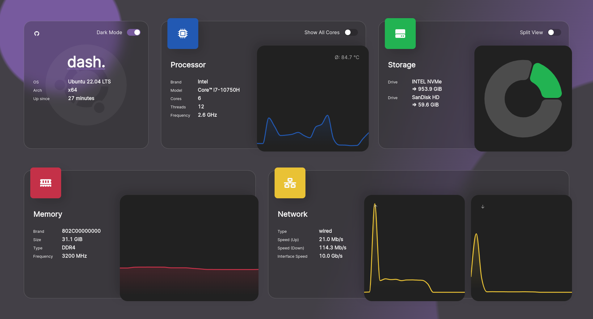
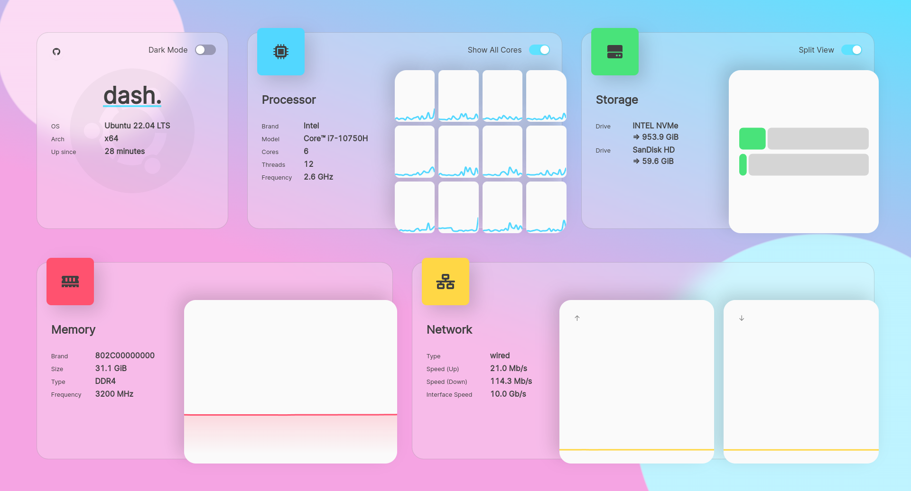

<!-- markdownlint-disable -->


#


<!-- markdownlint-enable -->

**healthcare dashboard react node** is a so any contribution is highly appreciated.
If you are interested in further developing this project, have a look at the
[Contributing.md](./.github/CONTRIBUTING.md).

In case you want to financially support this project, you can visit my
[GitHub Sponsors](https://github.com/sponsors/MauriceNino), or my [Ko-Fi](https://ko-fi.com/mauricenino).

## Preview

<!-- markdownlint-disable -->

| Dark-Mode                                                                                    | Light-Mode                                                                                     |
| -------------------------------------------------------------------------------------------- | ---------------------------------------------------------------------------------------------- |
|  |  |

<!-- markdownlint-enable -->

## Documentation

- [Installation Options](https://getdashdot.com/docs/install)
- [Configuration Options](https://getdashdot.com/docs/config)
- [Contributing](./.github/CONTRIBUTING.md)
- [Changelog](./.github/CHANGELOG.md)

## Quick Install (Docker)

Images are hosted on [DockerHub](https://hub.docker.com/r/mauricenino/dashdot),
and are available for both AMD64 and ARM devices.

```bash
docker container run -it \
  -p 80:3001 \
  -v /:/mnt/host:ro \
  --privileged \
  mauricenino/dashdot
```

To get more information on why which flag is needed, or if you want to use other
install options instead (`docker-compose`, or from source), have a look at the
[installation options](https://getdashdot.com/docs/install).

To read more about configuration options, you can visit the [configuration options](https://getdashdot.com/docs/config).
